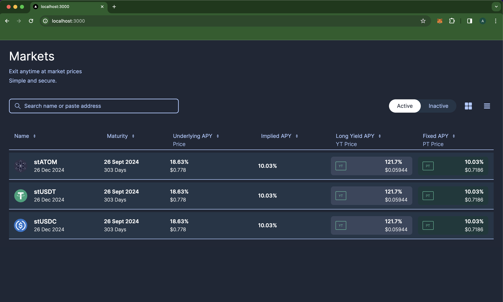

# UnUniFi: Seamless Design Integration with Next.js, Tailwind CSS, and Figma Design Tokens

## Overview

Unlock a unified development experience with UnUniFi, a project that demonstrates the seamless integration of Figma design tokens into a Next.js application, powered by Tailwind CSS for efficient styling. Built as a front-end assignment, it showcases a practical approach to translating design intent into production-ready code.

## Key Features

- **Design-Driven Development**: Effortlessly synchronize design and code with Figma design tokens.
- **Next.js Performance and SEO**: Benefit from Next.js's robust framework for building performant and SEO-friendly applications.
- **Tailwind CSS Utility-First Approach**: Embrace a flexible and maintainable styling approach with Tailwind CSS.

## Getting Started

### Prerequisites:

- Node.js
- npm (Node Package Manager)

### Installation:

1. **Clone the repository**:
   ```bash
   git clone https://github.com/Giri-Aayush/UnUniFi---Assignment.git
   ```
2. **Navigate to the project directory**:
    ```bash
    cd UnUniFi---Assignment
    ```
3. **Install dependencies**:
    ```bash
    npm install
    ```
4. **Design Token Integration**:

    Export Design Tokens from Figma:
    - Use the 'Variables Export Import' plugin to export local variables.
    - Copy the output to exportedVariables.json.

5. **Convert Design Tokens**:
    ```bash
    node convertVariables.js
    ```
    This script generates variableOutput.js for Tailwind configuration.

6. **Start Development Server**:
    ```bash
    npm run dev
    ```

## Screenshots



## Additional Enhancements:
- Continuous Integration and Deployment (CI/CD): Implement a CI/CD pipeline for automated testing and deployment.
- Accessibility: Ensure the application is accessible to users with disabilities.
- Performance Optimization: Conduct thorough performance analysis and optimization.